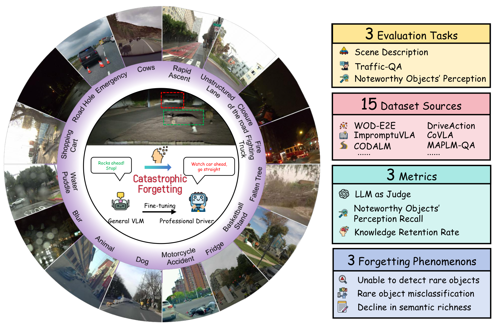
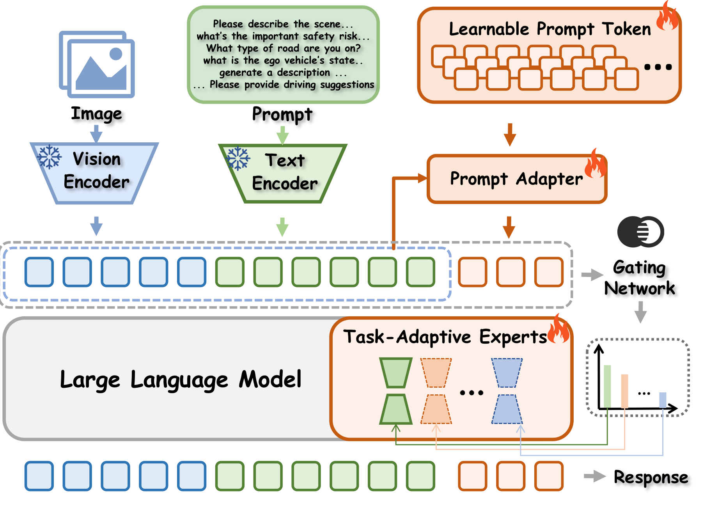

<h1 align="left">
  <span style="vertical-align: middle;">[CVPR2026]The Blind Spot of Adaptation: Quantifying and Mitigating Forgetting in Fine-tuned Driving Models</span>
</h1>

<div align="center">
    <!-- <p>
        <a href="https://github.com/AutoLab-SAI-SJTU/">
            
        </a>
    </p> -->
    <p>
        Runhao Mao<sup>*</sup>&nbsp;&nbsp;
        <a href="https://veritas12.github.io/">Hanshi Wang</a><sup>*</sup>&nbsp;&nbsp;
        Yixiang Yang<sup></sup>&nbsp;&nbsp;
        Qianli Ma<sup></sup>&nbsp;&nbsp;
        Jingmeng Zhou<sup></sup>&nbsp;&nbsp;
        <a href="https://zhipengzhang.cn/">Zhipeng Zhang</a><sup>✉</sup>
    </p>
    <p>
        AutoLab, School of Artificial Intelligence, Shanghai Jiao Tong University
    </p>
    <p>
        <sup>*</sup> Equal contribution
        <br>
        <sup>✉</sup> Corresponding author
    </p>
    <p>
        <a href="mailto:amao769909148@gmail.com">amao769909148@gmail.com</a> ·
        <a href="mailto:zhipeng.zhang.cv@outlook.com">zhipeng.zhang.cv@outlook.com</a>
    </p>
</div>

<p align="center">
    <a href="https://arxiv.org/pdf/2604.04857"></a>
    <a href="./train/train_qwen_moe_lora_v4_flash.py"></a>
    <a href="https://huggingface.co/datasets/AutoLab-SJTU/FidelityDrivingBench/tree/main"></a>
</p>

<!-- <p align="center">

</p> -->

<p align="center">
    
    &nbsp;&nbsp;
    
</p>

<p align="center">
    <i>The first systematic benchmark and mitigation framework for catastrophic forgetting in VLM-centric autonomous driving.</i>
</p>

## 📰 News
- [2026.04.07] 🎉 🎉 Code, paper and dataset are released.
- [2026.02.21] 🎉 🎉 Our paper has been accepted by CVPR 2026!

<!-- ## 🔍 Highlights
- The first benchmark specifically designed to quantify catastrophic forgetting in fine-tuned driving VLMs.
- A large-scale driving corpus with `180K` scenes from `15` data sources.
- A new `Knowledge Retention Rate (KRR)` metric for measuring post-adaptation knowledge preservation.
- A new `Drive Expert Adapter (DEA)` that improves VL driving-task performance while mitigating forgetting. -->

## 📖 Overview
Vision-Language Models bring strong world knowledge and long-tail generalization to autonomous driving, but standard fine-tuning can silently destroy these capabilities. FidelityAD studies this blind spot systematically by introducing a dedicated forgetting benchmark and a mitigation framework tailored for driving VLMs.

We build **Fidelity Driving Bench**, a large-scale benchmark for quantifying forgetting in autonomous driving, and propose **Drive Expert Adapter (DEA)**, which shifts adaptation from destructive weight updates to prompt-level and expert-level routing. Extensive experiments show that DEA improves downstream driving performance while better preserving pretrained knowledge.

Our main contributions are summarized as follows:

1. We provide the first systematic investigation of catastrophic forgetting in VLM-centric autonomous driving.
2. We introduce Fidelity Driving Bench, a large-scale benchmark built from 180K scenes and 900K QA pairs across 15 data sources.
3. We propose DEA, a new framework with a Prompt Adapter and a Task-Adaptive Expert Module for scene-aware knowledge routing.
4. We demonstrate that DEA mitigates forgetting while maintaining strong performance on driving-specific tasks.

## 🧠 Method
### Prompt Adapter
DEA learns prompt-level task priors and retrieves the most relevant prompt tokens according to the input question, helping the model adapt without overwriting core parameters.

### Task-Adaptive Expert Module
DEA further introduces a scene-aware expert routing mechanism that dynamically selects suitable driving experts according to prompt semantics and scene-specific cues.

## 📊 Main Results
Fidelity Driving Bench shows that many existing driving VLMs suffer substantial forgetting after adaptation. On the Qwen2.5VL-3B backbone, DEA achieves stronger task performance with better knowledge retention than full fine-tuning.

| Method | KRR | SD | T-QA | NoPR |
| --- | --- | --- | --- | --- |
| Base (Qwen2.5VL-3B) | - | 56.6 | 28.7 | 36.8 |
| ImpromptuVLA-3B | 68.4% | 59.1 | 33.0 | 25.2 |
| DEA (Base + TAEM + PA) | **79.0%** | 58.8 | **41.0** | **29.0** |

## 🧪 Benchmark
### Data Scale
- `180K` training scenes
- `900K` language QA pairs
- `15` source datasets
- `1,000` manually verified long-tail test images

### Evaluation Tasks
- Scene Description
- Traffic-QA
- Noteworthy Objects' Perception

### Metrics
- LLM-as-Judge (GPT Score)
- Noteworthy Objects' Perception Recall (NoPR)
- Knowledge Retention Rate (KRR)

## 🌐 Start DEA Training
The training pipeline can be launched with the provided shell script. A typical workflow is:

1. Clone the repository.
2. Create and activate a conda environment.
3. Install the training dependencies.
4. Update the paths in `train/train_DEA.sh`.
5. Run the training script.

```bash
git clone https://github.com/AutoLab-SAI-SJTU/FidelityDrivingBench.git
cd FidelityDrivingBench

conda create -n fidelityad python=3.10
conda activate fidelityad

pip install -r requirements.txt

cd train
# Please update the dataset path, checkpoint path, and output path in train_DEA.sh first.
sh train_DEA.sh
```

## ▶️ Start Evaluation
The evaluation service is designed as a local API server. You can start it with the following steps:

1. Install the evaluation dependencies.
2. Enter the `eval` directory.
3. Update the paths in eval/app.py. 
4. Launch the FastAPI service with `uvicorn`.
5. Submit a `.jsonl` file for scoring.

```bash
pip install -r requirements_eval.txt

cd eval
uvicorn app:app --host 0.0.0.0 --port 10086 --reload
```

### Evaluation APIs
- `gpt_score`: returns the GPT-based score.
- `gpt_eval`: returns the NoPR score.
- `gpt_acc`: returns the Traffic-QA accuracy.

### Example Request
Replace the input file path and server address with your own environment before running:

```bash
curl -F "file=@/path/to/test_input.jsonl" \
     -F "output_name=result.jsonl" \
     http://<server-ip>:8000/gpt_score
```

<!-- ## 🌐 Demo
Coming soon.

## 📦 Code
Coming soon.

## 🧊 Dataset
Coming soon.

## 🚀 Installation
Coming soon.

## ▶️ Inference
Coming soon. -->

### 📋 Checklist
- [x] Release paper
- [ ] Release dataset
- [ ] Release code
- [ ] Release trained models

<!-- ## 🙏 Acknowledgment -->
<!-- This repository currently hosts the project page and paper materials for FidelityAD. Additional resources including code, dataset, and checkpoints can be added here in future updates. -->

## 📜 Citation
If you find this work useful, please consider citing:

```bibtex
@inproceedings{mao2026blindspot,
  title={The Blind Spot of Adaptation: Quantifying and Mitigating Forgetting in Fine-tuned Driving Models},
  author={Mao, Runhao and Wang, Hanshi and Yang, Yixiang and Ma, Qianli and Zhou, Jingmeng and Zhang, Zhipeng},
  booktitle={Proceedings of the IEEE/CVF Conference on Computer Vision and Pattern Recognition (CVPR)},
  year={2026}
}
```
